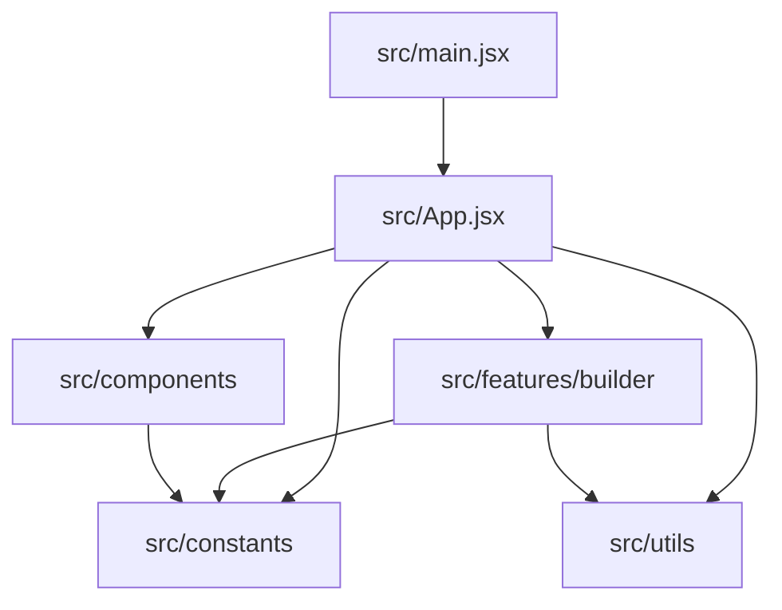

# Архитектура и соглашения (QuantSandbox)

Краткая карта для разработки. Подробности запуска и дерева папок — в [README.md](../README.md).

## Слои приложения



- **`App.jsx`** — корневой layout, переключение экранов (логин / основное приложение), большая часть состояния Strategy Builder и Hyperopt, вложенные таблицы результатов.
- **`features/builder`** — выносимые части конструктора: `FormulaEditor`, библиотека индикаторов, модалки add/edit indicator, `TableBasedEditor`, и т.д.
- **`components/*`** — доменные блоки (auth, heatmap, strategies, users, indicators, report, shared).
- **`constants`** — данные и конфиг без UI: `app.js`, `formulas.js`, `indicators.js`, `heatmap.js`, `ui.js`.
- **`utils`** — чистые функции (`weights`, `builder`, `mockResults`, `pythonCode`, …).

## Куда класть новый код

| Задача | Папка |
|--------|--------|
| UI только для этапа Builder / сигналов | `src/features/builder/components/` или `.../utils/` |
| Переиспользование на нескольких экранах | `src/components/<домен>/` + при необходимости barrel `index.js` |
| Новые константы формул / шаблонов | `src/constants/formulas.js` (или новый файл в `constants/` с экспортом) |
| Новые мок-списки приложения | `src/constants/app.js` или отдельный файл в `constants/` |
| Общий хук | `src/hooks/` |

Не вводить новый глобальный state-manager без явной задачи: по умолчанию `useState` / `useMemo` / `useCallback` в `App.jsx` или в дочерних компонентах.

## Стили и UI-примитивы

- Утилиты **Tailwind**; для склейки классов часто используется **`cx`** (см. импорты в `App.jsx` и компонентах).
- Общие токены/классы панелей — **`src/constants/ui.js`** (`ui.*`), по возможности переиспользовать.

## Данные и моки

| Источник | Назначение |
|----------|------------|
| `src/constants/app.js` | `INITIAL_STRATEGIES`, `MOCK_OPTIMIZATION_RUNS`, `PAIR_OPTIONS`, `TIME_RANGES`, `SECTIONS`, … |
| `src/App.jsx` | `hyperoptResultsRows` и связанные структуры для вложенных таблиц Hyperopt / Post-processing |
| `src/utils/mockResults.js` | `generateMockResults` для сетки HeatMap |

## Hyperopt / Post-processing (ориентиры по состоянию)

Состояние задаётся в **`App.jsx`** (имена могут слегка меняться — проверяйте файл).

- **`hyperoptRun`** — `"Pipeline"` | `"Admin run"`: влияет на видимость блока Post-processing в параметрах и кнопки Post-processing в таблице результатов.
- **`hyperoptType`** — `"BIAS"` | `"Brute Force"`: блок **Intermediate formula** скрыт только при Brute Force; блок **Post-processing** в параметрах не зависит от типа (остаётся видимым при Brute Force, если выбран Pipeline для Hyperopt run).
- **`hyperoptResultsExpanded`** — какие строки верхнего уровня таблицы Hyperopt развёрнуты (`Set` id строк).
- **`normalizationDetailsExpanded`** — раскрытие строки уровня «Data period» / post-processing result (ключи вида `normKey` в разметке).
- **`hyperoptLevel3Expanded`** — раскрытие строк «trunk» / вложенного уровня с HeatMaps & Reports (`Set` ключей `level3Key`).
- **`normModalCollapsedSections`** — сворачивание секций в модалке нормализации (stability / score).
- Отдельные наборы состояний для **Signal vs Entry** (префиксы `signal*` / `entry*`, переключение через `isEntryStage`).

При добавлении колонок или уровней вложенности таблиц — синхронизировать **`colSpan`** в `<td>` развёрнутых строк.

## Формулы

- Шаблоны кодов, списки переменных для редакторов — **`src/constants/formulas.js`**.
- Редактирование в UI: **`FormulaEditor`** и связанные модалки; часть полей формул намеренно **read-only** с блокировкой ввода (см. разметку в `App.jsx`).

## Зависимости, важные для Builder

- **`@monaco-editor/react`** — редактор кода на вкладке стратегии и в части модалок.

## Проверка после изменений

```bash
npm run build
npm run lint
```

При изменении навигации или списков секций — сверить **`SECTIONS` / `DISABLED_SECTIONS`** в `src/constants/app.js`.
