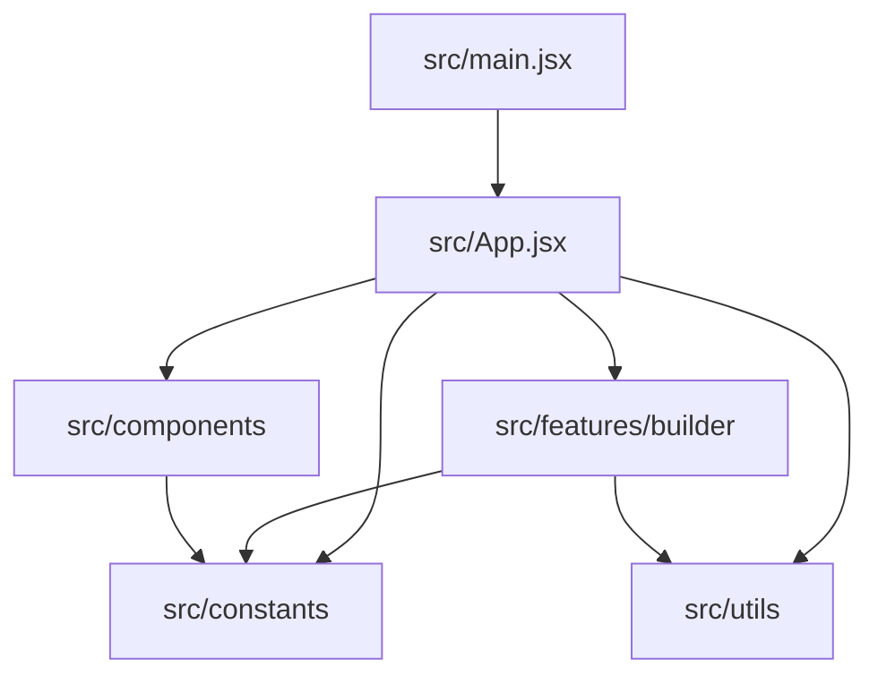

# Архитектура и соглашения (QuantSandbox)

Краткая карта для разработки. Подробности запуска и дерева папок — в [README.md](../README.md).

## Слои приложения


```mermaid
flowchart TB
  main[src/main.jsx]
  app[src/App.jsx]
  features[src/features/builder]
  components[src/components]
  constants[src/constants]
  utils[src/utils]

  main --> app
  app --> features
  app --> components
  app --> constants
  app --> utils
  features --> constants
  features --> utils
  components --> constants
```

- **`App.jsx`** — корневой layout, переключение экранов (логин / основное приложение), большая часть состояния Strategy Builder и Hyperopt, вложенные таблицы результатов. В `BuilderStepper` секции стратегии (Signal / Entry / Exit) нумеруются **1–6** и сворачиваются через `collapsedSections`: (1) Indicators, (2) Signal/Entry/Exit formula, (3) Indicator Ranges, (4) Hyperoptimization Parameters, (5) Optimization Results, (6) Favorite Epochs (бывшие Best scores).
- **`features/builder`** — выносимые части конструктора: `FormulaEditor`, `IndicatorLibrary`, `IndicatorRangesPanel`, модалки add/edit indicator, `TableBasedEditor`, и т.д.
- **`features/versioning`** — UI-мок иерархии версий стейджей (Signal→Final): dropdown на табах `BuilderStepper`, модалка дерева; данные в `constants/mockStageVersionTree.js`, логика фильтрации в `features/versioning/utils/versionSelection.js`.
- **`components/*`** — доменные блоки (auth, heatmap, strategies, users, indicators, report, shared).
- **`constants`** — данные и конфиг без UI: `app.js`, `formulas.js`, `indicators.js`, `heatmap.js`, `ui.js`.
- **`utils`** — чистые функции (`weights`, `builder`, `mockResults`, `pythonCode`, …).

## Куда класть новый код

| Задача | Папка |
|--------|--------|
| UI только для этапа Builder / сигналов | `src/features/builder/components/` или `.../utils/` |
| Переиспользование на нескольких экранах | `src/components/<домен>/` + bridge в `src/components/common/` (`AppButton`, …) |
| Новые константы формул / шаблонов | `src/constants/formulas.js` (или новый файл в `constants/` с экспортом) |
| Новые мок-списки приложения | `src/constants/app.js` или отдельный файл в `constants/` |
| Версии стейджей (lineage-дерево) | `src/constants/versioning.js`, `src/constants/mockStageVersionTree.js` |
| Общий хук | `src/hooks/` |

Не вводить новый глобальный state-manager без явной задачи: по умолчанию `useState` / `useMemo` / `useCallback` в `App.jsx` или в дочерних компонентах.

## Стили и UI-примитивы

- Утилиты **Tailwind CSS v4** (`@tailwindcss/vite`); для склейки классов — **`cx`** (`src/constants/ui.js`) или **`cn`** (`src/lib/utils.js` для shadcn).
- **Dual-theme (legacy / prod)**: переключатель `UI: Legacy / Prod` в header; `localStorage.uiVariant` или `VITE_UI_THEME=legacy|prod`; на `<html>` выставляется `data-ui`. Откат: `localStorage.setItem('uiVariant','legacy')` + reload.
- **Токены**: `src/constants/ui.legacy.js` (замороженный baseline), `src/constants/ui.prod.js`, фасад `ui.js` → `getUiTokens()`. CSS variables в `src/index.css` для `:root[data-ui="legacy"]` и `:root[data-ui="prod"]`.
- **Prod layout**: `builderLayout` = `horizontal` (legacy) | `sidebar` (prod); компоненты в `src/components/prod/`, `src/features/builder/layout/`.
- **h2d**: снимки прода декодируются `node scripts/h2d-decode.mjs <file.h2d>`.
- **shadcn/ui (Radix Nova)**: примитивы в **`src/components/ui/`**; bridge в **`src/components/common/`** (`AppButton`, …).
- Новые примитивы: `npm run ui:add -- <component>`; `npm run ui:add:overwrite -- <component>` — осторожно, сбрасывает кастомизацию.

## Данные и моки

| Источник | Назначение |
|----------|------------|
| `src/constants/app.js` | `INITIAL_STRATEGIES`, `MOCK_OPTIMIZATION_RUNS`, `PAIR_OPTIONS`, `TIME_RANGES`, `SECTIONS`, … |
| `src/App.jsx` | `hyperoptResultsRows` и связанные структуры для вложенных таблиц Hyperopt / Post-processing |
| `src/utils/mockResults.js` | `generateMockResults` для сетки HeatMap |

## Hyperopt / Post-processing (ориентиры по состоянию)

Состояние задаётся в **`App.jsx`** (имена могут слегка меняться — проверяйте файл).

- **`hyperoptRun`** — `"Pipeline"` | `"Admin run"`: влияет на видимость блока Post-processing в параметрах и кнопки Post-processing в таблице результатов.
- **`hyperoptType`** — `"BIAS"` | `"Brute Force"`: блок **Intermediate formula** скрыт только при Brute Force; блок **Post-processing** в параметрах не зависит от типа (остаётся видимым при Brute Force, если выбран Pipeline для Hyperopt run).
- **`hyperoptResultsExpanded`** — какие строки верхнего уровня таблицы Hyperopt развёрнуты (`Set` id строк).
- **`normalizationDetailsExpanded`** — раскрытие строки уровня «Data period» / post-processing result (ключи вида `normKey` в разметке).
- **`hyperoptLevel3Expanded`** — раскрытие строк «trunk» / вложенного уровня с HeatMaps & Reports (`Set` ключей `level3Key`).
- **`normModalCollapsedSections`** — сворачивание секций в модалке нормализации (stability / score).
- Отдельные наборы состояний для **Signal vs Entry** (префиксы `signal*` / `entry*`, переключение через `isEntryStage`).

При добавлении колонок или уровней вложенности таблиц — синхронизировать **`colSpan`** в `<td>` развёрнутых строк.

## Формулы

- Шаблоны кодов, списки переменных для редакторов — **`src/constants/formulas.js`**.
- Редактирование в UI: **`FormulaEditor`** и связанные модалки; часть полей формул намеренно **read-only** с блокировкой ввода (см. разметку в `App.jsx`).

## Зависимости, важные для Builder

- **`@monaco-editor/react`** — редактор кода на вкладке стратегии и в части модалок.

## Проверка после изменений

```bash
npm run build
npm run lint
```

При изменении навигации или списков секций — сверить **`SECTIONS` / `DISABLED_SECTIONS`** в `src/constants/app.js`.
