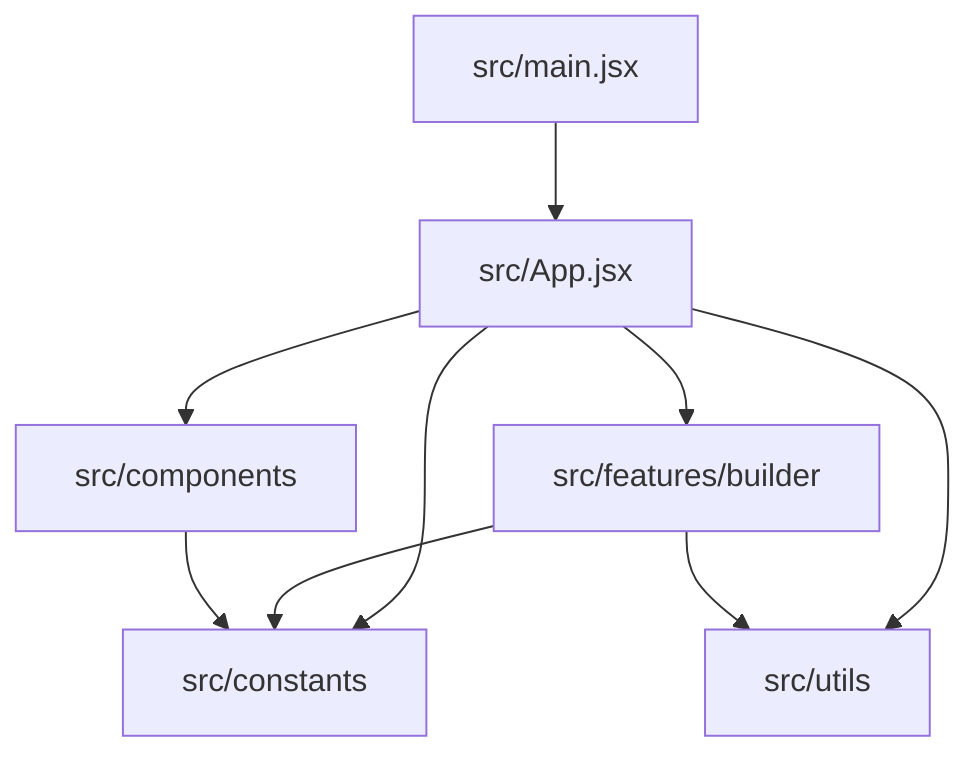

# Архитектура и соглашения (QuantSandbox)

Краткая карта для разработки. Подробности запуска и дерева папок — в [README.md](../README.md).

## Слои приложения


```mermaid
flowchart TB
  main[src/main.jsx]
  app[src/App.jsx]
  features[src/features/builder]
  components[src/components]
  constants[src/constants]
  utils[src/utils]

  main --> app
  app --> features
  app --> components
  app --> constants
  app --> utils
  features --> constants
  features --> utils
  components --> constants
```

- **`App.jsx`** (~1650 строк) — shell: auth/login, навигация (Strategies / Mini Backtest / Settings / Users), routing между секциями, глобальные модалки (Mini Backtest, Report, Version Tree), тэги/hyperopt-rows, Mini Backtest results. Монтирует `BuilderStepper`.
- **`features/builder/BuilderStepper.jsx`** (~5300 строк) — основной компонент конструктора. Секции стратегии (Signal / Entry / Exit / Risk) нумеруются **1–6** и сворачиваются через `useCollapsedSections()`: (1) Indicators, (2) Signal/Entry/Exit formula, (3) Indicator Ranges, (4) Hyperoptimization Parameters, (5) Optimization Results, (6) Favorite Epochs.
- **`features/builder/hooks/`** — доменные хуки, вынесенные из `BuilderStepper`:
  - `useHyperoptResultsState` — expand/collapse таблицы результатов (`hyperoptResultsExpanded`, `normalizationDetailsExpanded`, `hyperoptLevel3Expanded`, `normModalCollapsedSections`).
  - `useCollapsedSections` — сворачивание секций конструктора.
  - `useBuilderStageConfig` — per-stage hyperopt/market config (hyperoptType, exchange, tradingMode, syntheticDataset, maxPossibleStd, unknowTimeRange, foldSize).
- **`features/builder`** — выносимые части конструктора: `FormulaEditor`, `IndicatorLibrary`, `IndicatorRangesPanel`, модалки add/edit indicator, `TableBasedEditor`, и т.д.
- **`features/backtesting`** — **Stage 5 «Backtesting»**: экран стейджа, иерархическая таблица веток, формы запуска и мок-стор. Точка входа — `BacktestingStagePanel`, монтируется из `BuilderStepper` при `active.id === 5`. Подробнее — раздел «Stage 5 — Backtesting» ниже.
- **`features/versioning`** — UI-мок иерархии версий стейджей (Signal→Final): dropdown на табах `BuilderStepper`, модалка дерева; данные в `constants/mockStageVersionTree.js`, логика фильтрации в `features/versioning/utils/versionSelection.js`.
- **`components/*`** — доменные блоки (auth, heatmap, strategies, users, indicators, report, shared).
- **`constants`** — данные и конфиг без UI: `app.js`, `formulas.js`, `indicators.js`, `heatmap.js`, `ui.js`.
- **`utils`** — чистые функции (`weights`, `builder`, `mockResults`, `pythonCode`, …).

## Куда класть новый код

| Задача | Папка |
|--------|--------|
| UI только для этапа Builder / сигналов | `src/features/builder/components/` или `.../utils/` |
| Переиспользование на нескольких экранах | `src/components/<домен>/` + bridge в `src/components/common/` (`AppButton`, …) |
| Новые константы формул / шаблонов | `src/constants/formulas.js` (или новый файл в `constants/` с экспортом) |
| Новые мок-списки приложения | `src/constants/app.js` или отдельный файл в `constants/` |
| Версии стейджей (lineage-дерево) | `src/constants/versioning.js`, `src/constants/mockStageVersionTree.js` |
| Общий хук | `src/hooks/` |
| UI / логика Stage 5 (Backtesting) | `src/features/backtesting/` (`components/`, `components/forms/`, `hooks/`, `utils/`); справочники и копирайт — `src/constants/backtesting.js` |

Не вводить новый глобальный state-manager без явной задачи: по умолчанию `useState` / `useMemo` / `useCallback` в `BuilderStepper.jsx` или доменных хуках в `features/builder/hooks/`. Общий доменный хук → `src/hooks/`.

## Стили и UI-примитивы

- Утилиты **Tailwind CSS v4** (`@tailwindcss/vite`); для склейки классов — **`cx`** (`src/constants/ui.js`) или **`cn`** (`src/lib/utils.js` для shadcn).
- **Dual-theme (legacy / prod)**: переключатель `UI: Legacy / Prod` в header; `localStorage.uiVariant` или `VITE_UI_THEME=legacy|prod`; на `<html>` выставляется `data-ui`. Откат: `localStorage.setItem('uiVariant','legacy')` + reload.
- **Токены**: `src/constants/ui.legacy.js` (замороженный baseline), `src/constants/ui.prod.js`, фасад `ui.js` → `getUiTokens()`. CSS variables в `src/index.css` для `:root[data-ui="legacy"]` и `:root[data-ui="prod"]`.
- **Prod layout**: `builderLayout` = `horizontal` (legacy) | `sidebar` (prod); компоненты в `src/components/prod/`, `src/features/builder/layout/`.
- **h2d**: снимки прода декодируются `node scripts/h2d-decode.mjs <file.h2d>`.
- **shadcn/ui (Radix Nova)**: примитивы в **`src/components/ui/`**; bridge в **`src/components/common/`** (`AppButton`, …).
- Новые примитивы: `npm run ui:add -- <component>`; `npm run ui:add:overwrite -- <component>` — осторожно, сбрасывает кастомизацию.

## Данные и моки

| Источник | Назначение |
|----------|------------|
| `src/constants/app.js` | `INITIAL_STRATEGIES`, `MOCK_OPTIMIZATION_RUNS`, `PAIR_OPTIONS`, `TIME_RANGES`, `SECTIONS`, … |
| `src/App.jsx` | `hyperoptResultsRows` и связанные структуры для вложенных таблиц Hyperopt / Post-processing |
| `src/utils/mockResults.js` | `generateMockResults` для сетки HeatMap |

## Hyperopt / Post-processing (ориентиры по состоянию)

Состояние распределено между `BuilderStepper.jsx` и вынесенными хуками.

- **`hyperoptRun`** — `"Pipeline"` | `"Admin run"`: в `BuilderStepper`; влияет на видимость Post-processing блока.
- **`hyperoptType`** — per-stage через `useBuilderStageConfig`; `"BIAS"` | `"Brute Force"`: блок **Intermediate formula** скрыт только при Brute Force.
- **`hyperoptResultsExpanded`**, **`normalizationDetailsExpanded`**, **`hyperoptLevel3Expanded`**, **`normModalCollapsedSections`** — управляются `useHyperoptResultsState` (`features/builder/hooks/useHyperoptResultsState.js`).
- Per-stage market config (exchange, tradingMode, syntheticDataset, maxPossibleStd, unknowTimeRange, foldSize) — `useBuilderStageConfig` (`features/builder/hooks/useBuilderStageState.js`).

При добавлении колонок или уровней вложенности таблиц — синхронизировать **`colSpan`** в `<td>` развёрнутых строк.

## Формулы

- Шаблоны кодов, списки переменных для редакторов — **`src/constants/formulas.js`**.
- Редактирование в UI: **`FormulaEditor`** и связанные модалки; часть полей формул намеренно **read-only** с блокировкой ввода (см. разметку в `App.jsx`).

## Зависимости, важные для Builder

- **`@monaco-editor/react`** — редактор кода на вкладке стратегии и в части модалок.

## Проверка после изменений

```bash
npm run build
npm run lint
```

При изменении навигации или списков секций — сверить **`SECTIONS` / `DISABLED_SECTIONS`** в `src/constants/app.js`.


## Stage 5 — Backtesting

Пятый стейдж пайплайна (`Signal → Entry → Exit → Risk → Backtesting`). Реализован по ТЗ
«QuantSandbox · Stage 5 — Backtesting» v1.0 и логической спеке «Единая логика размещения объектов» v1.1.

### Иерархия объектов

```
Stage 5 (контекст: стратегия + favorite-эпоха из Stage 4)
└── Level 0 · BacktestRun            ← единственный корневой объект
    ├── Level 1 · ShufflerRun(s)     ← источник задан родителем, не выбирается
    ├── Level 1 · SyntheticRun(s)
    └── Level 1 · ValidationAnalytics(s)   ← комбинация «бэктест + 1 shuffler + 1 synthetic»
```

Ключевой инвариант: `backtest_id` дочерних объектов immutable, поэтому состояние «chain broken»
невозможно по построению и проверка lineage (C7) не реализуется. Остаётся только проверка
сравнимости (C6) — `utils/integrity.js`.

### Карта модулей

| Файл | Назначение |
|---|---|
| `BacktestingStagePanel.jsx` | Корневой экран: 3 секции (`BuilderSectionShell`), все модалки, подтверждения удаления |
| `components/EpochContextPanel.jsx` | «Configuration under validation» — селектор favorite-эпохи + read-only карточки Stages 1–4 (индикаторы / risk) |
| `components/forms/RunBacktestForm.jsx` | Инлайн-форма запуска Backtest в секции 1 (mini + params); `RunBacktestModal` — тонкая обёртка |
| `components/BacktestTree.jsx` | Таблица Level 0 (8 колонок: expand, ID-copy, Pairs, Timeframe, Time Range, Status, Created, Action), разворот ветки через `<tr><td colSpan={8}>` |
| `components/BranchPanel.jsx` | Содержимое ветки: панель действий + 4 сворачиваемых уровня (Core metrics / Shuffler / Synthetic / Analytics) |
| `components/CoreMetricsCompareTable.jsx` | Таблица METRIC · BACKTEST · MINI-BACKTEST · Δ |
| `components/AnalyticsArchivePanel.jsx` | Архив эпохи: saved-аналитики удалённых веток (read-only) |
| `components/forms/*` | 4 формы запуска: `RunBacktestModal`, `RunShufflerModal` (+ `PessimismGrid`), `RunSyntheticModal`, `CreateAnalyticsModal`, `AnalyticsDraftModal` |
| `components/RunResultPreviewModal.jsx` | Core-таблицы результатов (полные вью §6 — следующая итерация) |
| `hooks/useBacktestingState.js` | Мок-стор `{ [epochId]: { runs, archive } }` + мутации + симуляция прогресса |
| `hooks/useBacktestTreeState.js` | Expand/collapse (`Set`, тот же идиом, что `useHyperoptResultsState`) |
| `utils/integrity.js` | C6-сравнимость трёх линий, блокеры Save |
| `utils/shufflerValidity.js` | Правила валидности метрик STATIC/DYNAMIC (§6.2.1) |
| `utils/pessimism.js` | Грид уровней: `Runs = floor(share × shuffles)`, таргеты от Original, недостижимые значения |
| `utils/miniSource.js` | Адаптер над Mini Backtest: `Mini#N`, наследование параметров, diff «✎ edited» |
| `utils/format.js` | Форматтеры + цветовая семантика §8.7 и перцентильные зоны |
| `utils/mockResults.js` | Детерминированные мок-результаты (сид от id рана) |
| `utils/seed.js` | Демо-ветки для сидовой эпохи |

### Соглашения, специфичные для стейджа

- **Цвета чисел (§8.7):** красный — отрицательное, зелёный — положительное, **янтарный — просадка**
  (записана положительной, но всегда потеря), нейтральный — счётчики/даты. Перцентильные зоны
  40–60 % зелёная · 25–75 % жёлтая · вне — красная. Используется `green-*`/`red-*`, **не `emerald-*`**
  (prod-тема ремапит emerald в фиолетовый).
- **`colSpan`:** таблица Level 0 — 8 колонок (`LEVEL0_COLS` в `BacktestTree.jsx`). При добавлении
  колонки синхронизировать константу.
- **Секции стейджа** нумеруются 1–3 и имеют **свой** экземпляр `useCollapsedSections()` —
  нумерация не пересекается с секциями стейджей 1–4.
- **Комиссии** никогда не вводятся руками: `resolveBtFees(exchange, mode)` в `constants/backtesting.js`.
  Это единственное штатное отличие бэктеста от mini, и именно его измеряет Δ.
- **Кнопка `▶ Run Backtest`** живёт в секции 1 (инлайн `RunBacktestForm`), а не в аккордеоне
  секции 2: заголовок `BuilderAccordion` сам является `<button>`, вложенная кнопка ломает клик.
- **Конфиг Stages 1–4:** `utils/resolveEpochStageConfig.js` — frozen `indicatorsByStage` /
  `riskParams` на risk-favorite, иначе walk live source-chain (`signal/entry/exitBestResults`).

### Точки подключения

| Файл | Правка |
|---|---|
| `src/constants/versioning.js` | `STAGE_TYPE_LABELS.final = "Backtesting"` (внутренний ключ стейджа остался `"final"`) |
| `src/features/builder/BuilderStepper.jsx` | запись стейджа 5 (`label`, `title`, `locked: !backtestingEnabled`), монтирование панели, сид `riskBestResults` |
| `src/features/builder/utils/stageSelect.js` | `pickByStage` — ветка для стейджа 5 (иначе он молча наследует состояние Signal); `getBuilderStageCopy` — `case 5` |
| `src/features/builder/utils/defaultBbSetup.js` | `createDefaultRiskFavoriteEpoch()` — сидовая favorite-эпоха с risk-гиперпараметрами |
| `src/constants/featureFlags.js`, `FeatureFlagsDropdown.jsx`, `src/App.jsx` | флаг `backtesting` (по умолчанию `true`) |

### Тесты

`npm test` покрывает чистую логику стейджа: `integrity`, `shufflerValidity`, `pessimism`,
`miniSource`, `format` (`src/features/backtesting/utils/*.test.js`).
